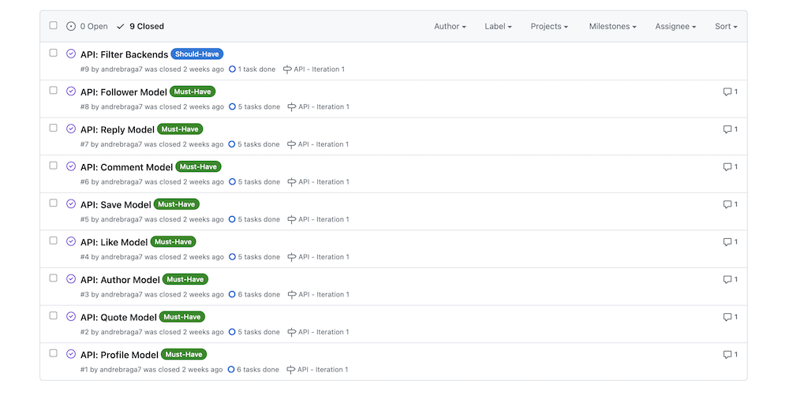
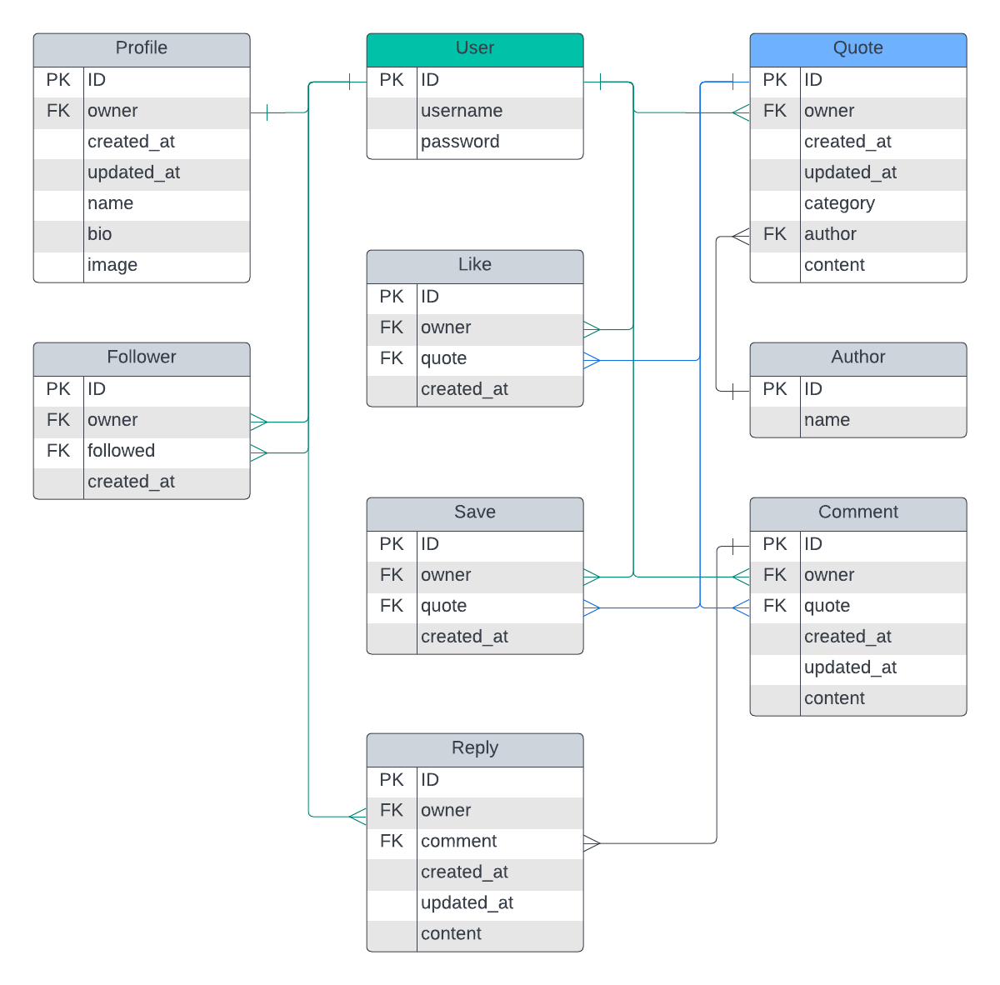
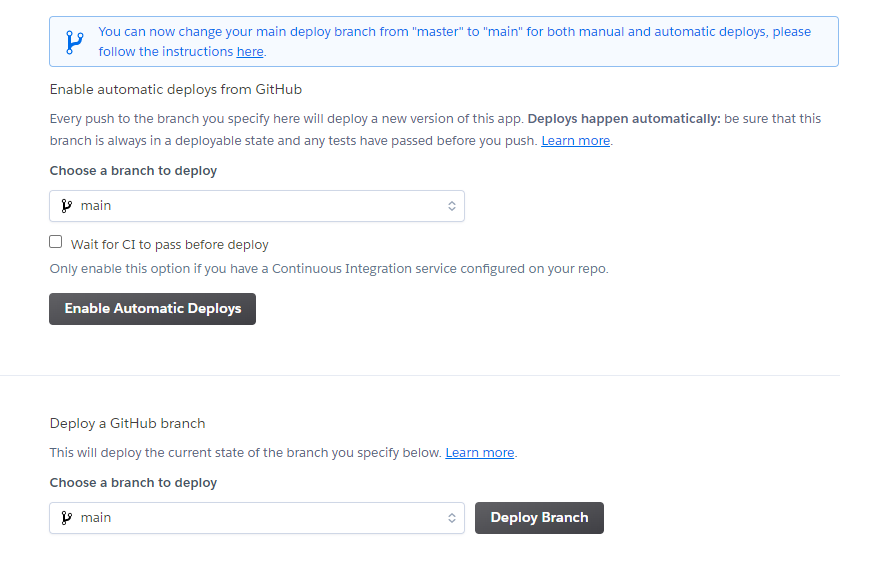

# Quotme API
Quotme API was developed to serve [Quotme](https://quotme.herokuapp.com) front end project. The API has the following apps that help make the fron end project versatile and robust: *Profiles*, *Quotes*, *Authors*, *Likes*, *Saved*, *Comments*, *Replies* and *Followers*. You can find out more about the **Quotme** front end project by having a look at the readme file and Github repository [here](https://github.com/andrebraga7/quotme/blob/main/README.md).

# Table of content

- [**User Stories**](#user-stories)
- [**Data Model**](#erd---entity-relatinship-diagram)
- [**Technologies Used**](#technologies-used)
- [**Testing**](#testing)
- [**Known Bugs**](#known-bugs)
- [**Deployment**](#deployment)
- [**Credits**](#credits)
- [**Acknowledgement**](#acknowledgements)

# User Stories
In order to plan the develop of the project I created the following issues using **Github Board**:



[Back to top](#table-of-content)

# ERD - Entity Relatinship Diagram
The ERD diagram was deeloped used [Lucidchart](https://www.lucidchart.com/) and it helped me to visualize all the necessary models to make the front end project possible.
The Django built in user model was used along with the following custom models:

- **Profile (user profile)** - Useed to store user aditional information like *name*, *bio* and *profile image*;
- **Quotes** - Stores all information for the quote;
- **Authors** - This model generates gets or creates a new author instance when creating a quote;
- **Likes** - Store likes information for quotes;
- **Saved** - This model is used to store user saved quotes information;
- **Comments** - Used to store comment information for each quote;
- **Replies** - The replies model is related to the comment and store replies for each comment;
- **Followers** - Model used to store followers information for users.



[Back to top](#table-of-content)

 # **Technologies used**

 ## Languages
- [Python](https://en.wikipedia.org/wiki/Python_(programming_language)) - Provides the functionality for the backend API.

## Frameworks & Software
- [Django REST](https://www.django-rest-framework.org/) - Django REST framework is a powerful and flexible toolkit for building Web APIs.
- [Github](https://github.com/) - Used to host and edit the website;
- [Gitpod](https://www.gitpod.io) used to push changes to the GitHub repository;
- [GitBash](https://en.wikipedia.org/wiki/Bash_(Unix_shell)) - Terminal in gitpod;
- [Heroku](https://en.wikipedia.org/wiki/Heroku) - A cloud platform that the application is deployed to;
- [Cloudinary](https://cloudinary.com/) - A service that hosts all static files in the project;
- [CI PEP8 Linter](https://pep8ci.herokuapp.com/) - used to validate the Python code.

## Libraries
In the list below are all the libraries used in the project, these are located in *requirements.txt*:

- [asgiref](https://pypi.org/project/asgiref/) - ASGI is a standard for Python asynchronous web apps and servers to communicate with each other, and positioned as an asynchronous successor to WSGI;
- [cloudinary](https://pypi.org/project/cloudinary/) - The Cloudinary Python SDK allows you to quickly and easily integrate your application with Cloudinary. Effortlessly optimize, transform, upload and manage your cloud's assets;
- [dj-database-url](https://pypi.org/project/dj-database-url/) - Used to configure Django application.
- [Django](https://pypi.org/project/Django/) - Django is a high-level Python web framework that encourages rapid development and clean, pragmatic design.
- [django-allauth](https://pypi.org/project/django-allauth/) - Integrated set of Django applications addressing authentication, registration, account management as well as 3rd party (social) account authentication.
- [django-cloudinary-storage](https://pypi.org/project/dj3-cloudinary-storage/) - Django Cloudinary Storage is a Django package that facilitates integration with Cloudinary by implementing Django Storage API.
- [django-cors-headers](https://pypi.org/project/django-cors-headers/) - A Django App that adds Cross-Origin Resource Sharing (CORS) headers to responses. This allows in-browser requests to your Django application from other origins.
- [django-filter](https://pypi.org/project/django-filter/) - Django-filter is a generic, reusable application to alleviate writing some of the more mundane bits of view code.
- [djangorestframework-simplejwt](https://pypi.org/project/djangorestframework-simplejwt/) - Simple JWT is a JSON Web Token authentication plugin for the Django REST Framework.
- [gunicorn](https://pypi.org/project/gunicorn/) - Gunicorn ‘Green Unicorn’ is a Python WSGI HTTP Server for UNIX. It’s a pre-fork worker model ported from Ruby’s Unicorn project. The Gunicorn server is broadly compatible with various web frameworks, simply implemented, light on server resource usage, and fairly speedy.
- [oauthlib](https://pypi.org/project/oauthlib/) - OAuthLib is a framework which implements the logic of OAuth1 or OAuth2 without assuming a specific HTTP request object or web framework.
- [Pillow](https://pypi.org/project/Pillow/) - The Python Imaging Library adds image processing capabilities to your Python interpreter.
- [psycopg2](https://pypi.org/project/psycopg2/) - Psycopg is the most popular PostgreSQL database adapter for the Python programming language.
- [PyJWT](https://pypi.org/project/PyJWT/) - A Python implementation of RFC 7519.
- [python3-openid](https://pypi.org/project/python3-openid/) - OpenID support for modern servers and consumers.
- [pytz](https://pypi.org/project/pytz/) - This is a set of Python packages to support use of the OpenID decentralized identity system in your application, update to Python 3
- [requests-oauhlib](https://pypi.org/project/requests-oauthlib/) - Provides first-class OAuth library support for Requests.
- [sqlparse](https://pypi.org/project/sqlparse/) - sqlparse is a non-validating SQL parser for Python. It provides support for parsing, splitting and formatting SQL statements.

[Back to top](#table-of-content)

# **Testing**
All code was passed throught the CI PEP Linter with no issues. During the development process the Prettier extension was used to check the code as it was being typed, this ensured code errors where being fixed during development.

## Manual testing
Manual testing was performed throughout development, ensuring the database was being updated as expected when creating, reading, updating or deleting data, where appropriate.

# **Known Bugs**
There are currently no known bugs in this project.

# **Deployment**

## Deployment To Heroku
The project was deployed to [Heroku](https://www.heroku.com). To deploy, please follow the steps below:

1. Navigate to your [Heroku dashboard](https://dashboard.heroku.com/apps).

2. Click "New" and select "Create new app".


3. Input a meaningful name for your app and choose the region best suited to your location.


4. Select "Deploy" from the tabs.


5. Select "GitHub - Connect to GitHub" from deployment methods.


6. Click "Connect to GitHub" in the created section.


7. Search for the GitHub repository by name.

8. Click to connect to the relevant repo.

9. Either click `Enable Automatic Deploys` for automatic deploys or `Deploy  Branch` to deploy manually. Manually deployed branches will need re-deploying each time the repo is updated.



10. Click `View` to view the deployed site.


[Back to top](#table-of-content)

## How To Fork The Repository On GitHub
It is possible to do a independent copy of a GitHub Repository by forking the GitHub account. The copy can then be viewed and it is also possible to do changes in the copy without affecting the original repository. To fork the repository, take these steps:

1. After logging in to GitHub, locate the repository. On the top right side of the page there is a 'Fork' button. Click on the button to create a copy of the original repository.

[Back to top](#table-of-content)

## Cloning The Project
To clone and set up this project you need to follow the steps below.

1. When you are in the repository, find the code tab and click it.
2. To the left of the green GitPod button, press the 'code' menu. There you will find a link to the repository. Click on the clipboard icon to copy the URL.
3. Use an IDE and open Git Bash. Change directory to the location where you want the cloned directory to be made.
4. Type 'git clone', and then paste the URL that you copied from GitHub. Press enter and a local clone will be created.
5. To be able to get the project to work you need to install the requirements. This can be done by using the command below:

* ```pip3 install -r requirements.txt``` - This command downloads and install all required dependencies that is stated in the requirements file.

6. The next step is to set up the environment file so that the project knows what variables that needs to be used for it to work. Environment variables are usually hidden due to sensitive information. It's very important that you don't push the env.py file to Github (this can be secured by adding env.py to the .gitignore-file). The variables that are declared in the env.py file needs to be added to the Heroku config vars. Don't forget to do necessary migrations before trying to run the server.

* ```python3 manage.py migrate``` - This will do the necessary migrations.
* ```python3 manage.py runserver``` - If everything i setup correctly the project is now live locally.

[Back to top](#table-of-content)

# **Credits**

## Content
- Template for readme provided by Code Institute (*with some additional changes that my mentor [Antonio Rodriguez](https://www.linkedin.com/in/antonio-rodr%C3%ADguez-bb9b99b7/))* suggested;

## Technical
- I used the django rest documentation to help me understand the framework and python concepts [Django REST Documentation](https://www.django-rest-framework.org/);
- [Stackoverflow](https://stackoverflow.com/), as always, was really helpfull with small helps and concepts explanation.

[Back to top](#table-of-content)

# Acknowledgements
Quotme-API was creates as the fifth portfolio project for the Full Stack Software Developer course from [**Code Institute**](https://codeinstitute.net). I would like to thank my mentor, [**Antonio Rodriguez**](https://www.linkedin.com/in/antonio-rodr%C3%ADguez-bb9b99b7/) for his guidance and support throught this project and the Code Institute team.

I would also like to thank the most important person that helped me throughout the entire course, my wife Evellyn. She has helped me through the dificult times and encouraged me to carry on. Here we are, te amo!

[**Andre Braga**](https://www.linkedin.com/in/andrestrevisan/) 2023

[Back to top](#table-of-content)